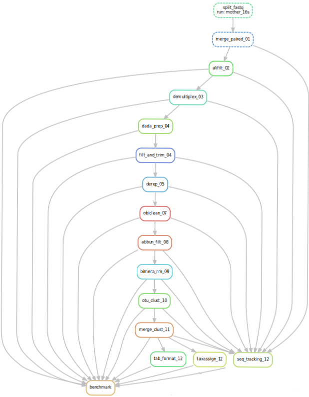

This pipeline starts from raw foward (R1) and reverse (R2) `.fastq` files and a `.tab` ngsfilter file.

This pipeline aims to respects the [FAIR](https://www.go-fair.org/fair-principles/) principles using [snakemake](https://snakemake.readthedocs.io/en/stable/#). 

# Description

Pipeline for raw NGS metabarcoding data processing using a combination of the OBItools, dada2 and sumaclust.

You'll find parameters used by the pipeline in the [config file](config/config.yaml).

DAG of the pipeline:

.

# Input

## Required

### Environment
In order to run this pipeline you need **snakemake**.

### Files

Raw illumina sequencing output for forward and reverse reads in `.fastq` format

Forward file named *XXX_R1.fastq* and reverse *XXX_R2.fastq*.

Additionally, you will need a text file named *XXX_ngsfilter.tab* as required by the [ngsfilter](https://pythonhosted.org/OBITools/scripts/ngsfilter.html) command of the obitools.

## Tree

This is what your directory tree should look like in order to run the pipeline.

Name with ```*.extension``` are file and other are folders.

The different **run** will be independantly processed.

Make sure that you have a different folders containing associated resources.

```bash
.
|-- Snakefile
|-- benchmarks
|-- config
|   |-- config.yaml
|-- dag
|-- log
|-- report
|-- resources
|   |
|   |-- run1
|   |   |-- run1_ngsfilter.tab
|   |   |-- run1_R1.fastq
|   |   |-- run1_R2.fastq
|   |-- run2
|       |-- run2_ngsfilter.tab
|       |-- run2_R1.fastq
|       |-- run2_R2.fastq
|-- results
|-- workflow
    |-- envs
    |   |-- R_env.yaml
    |   |-- obi_env.yaml
    |   |-- suma_env.yaml
    |-- rules
    |   |-- 01-pairing.smk
    |   |-- 02-sort_alignments.smk
    |   |-- 03-demultiplex.smk
    |   |-- 04-dada_prep.smk
    |   |-- 05-filterandtrim.smk
    |   |-- 06-derep.smk
    |   |-- 07-obi_clean.smk
    |   |-- 08-abbundance_filt.smk
    |   |-- 09-bimera_rm.smk
    |   |-- 10-otu_clust.smk
    |   |-- 11-merge_clust.smk
    |   |-- 12-format_out.smk
    |   |-- 12-seq_tracking.smk
    |   |-- 12-taxassign.smk
    |   |-- 13-benchmark.smk
    |-- scripts
        |-- benchmark.R
        |-- derep_dada2.R
        |-- filtandtrim_dada2.R
        |-- rm_bimera_dada2.R
        |-- seq_tracking.R
        |-- taxassign_dada2.R

```

# Pipeline steps and tools

## I - Pre-processing

### 1 - merging paired-end sequenced reads

**a** - split fasq for faster processing

**OBItools** - [*obidistribute*](https://pythonhosted.org/OBITools/scripts/obidistribute.html)

options : 
  - `-n` : number of files to split in, `nfile` in [`config`](config/config.yaml). (between 2 and 1000).

**b** - align paired-end sequence

**OBItools** - [*illuminapairedend*](https://pythonhosted.org/OBItools/scripts/illuminapairedend.html)

**c** - merge output and remove temp files

basic cat and rm UNIX commands.

### 2 - filtering alignments

**OBItools** - [*obiannotate*](https://pythonhosted.org/OBItools/scripts/obiannotate.html)

options :
  - `-S` : expression used for annotation, ali:`good` if alignment score > `minscore` in [`config`](config/config.yaml).
  else `bad`.

**OBItools** - [*obisplit*](https://pythonhosted.org/OBItools/scripts/obisplit.html)

options :
  - `-t` : split according to a condition, here `ali = good`.
  
  - `-p` : prefix of the resulting files.

### 3 - demultiplexing and tag/primer trimming

**a** - annotate average phred quality

**OBItools** - [*obiannotate*](https://pythonhosted.org/OBItools/scripts/obiannotate.html)

options : 
    - `-S` : expression used for annotation, Avgqphred:-int(math.log10(sum(sequence.quality)/len(sequence))\*10)

**b** - demultiplex according to the ngsfilter file

**OBItools** - [*ngsfilter*](https://pythonhosted.org/OBItools/scripts/ngsfilter.html)

options :
  - `-ngs` : ngs filter used for the demultiplexing in a `.tab` format.
  Check [input](##Required) for details about input format.
  - `-u` : name of the unassigned output file.
  
### 4 - prepare files for dada2

**OBItools** - [*obisplit*](https://pythonhosted.org/OBItools/scripts/obisplit.html)

options : 
    - `-t` : attribute to use for splitting, here `sample`.
    - `-p` : path to split into.

### 5 - sequence quality filtering and trimming

**dada2** - [*filterAndTrim*](https://rdrr.io/bioc/dada2/man/filterAndTrim.html)

options :
  - `truncLen`: 200, length at which perform trimming.
  - `maxN`: 0, maximum number of accepted `N` nucleotides. 
  - `maxEE`: 2, maximum number of accepted errors.
  - `truncQ`: 2, 
  - `matchIDs`: TRUE
  - `verbose`: TRUE
  - `multithread`: 15

### 6 - sequence dereplication

**dada2** - [*derepFastq*](https://rdrr.io/bioc/dada2/man/derepFastq.html)

options :
  - `n` : number of sequence simutaneously processed.

## II - Key processing 

### 1 - sequencing and error elimination 

**OBItools** - [*obiclean*](https://pythonhosted.org/OBItools/scripts/obiclean.html)

options :
  - `-r` : Threshold ratio between counts (rare/abundant counts) of two sequence records so that the less abundant one is a variant of the more abundant (default: 1, i.e. all less abundant sequences are variants)
  - `-H` : Select only sequences with the head status in a least one sample.
    
### 2 - Abundance filtering

**OBItools** - [*obigrep*](https://pythonhosted.org/OBITools/scripts/obigrep.html)

options : 
  - `-s` : Regular expression pattern to be tested against the sequence itself. The pattern is case insensitive. Here,  `'^[acgt]+$'` , corresponding only to sequence containing no ambiguous nucleotids (*e.g.* n).
  - `-p` : Predicat to filter, here `count>{params.mincount}` to filter on reads count.

## III - Post-processing

### 1 - Chimera removal

**dada2** - [*removeBimeraDenovo*](https://rdrr.io/bioc/dada2/man/removeBimeraDenovo.html)

options :
   - `multithread` : number of thread to use for bimera detection.

### 2 Sequence clustering

**sumaclust** - [*sumaclust*](https://git.metabarcoding.org/OBItools/sumaclust/-/wikis/home)

options :
   - `-t` : Score threshold for clustering (*e.g.* 0.97).
   - `-p` : Threads to use for clustering.
    
### 3 Merging Clusters

**OBItools** - [*obiselect*](https://pythonhosted.org/OBItools/scripts/obiselect.html)

options :
   - `-c` : Attribute used to categorize the sequence records, *i.e.* `cluster`.
   - `-n` : Indicates how many sequence records per group have to be retrieved, *i.e.* `1`.
   - `--merge` : Attribute to merge, *i.e.* `sample`.
   - `-f` :  function used to score the sequence, *i.e.* `count` to have the reads per sample.
   - `-M` : maximize the `-f` function and order sample IDs in the headers of the sequences by their reads count.

### 4 Output Formating

**OBItools** - [*obitab*](https://pythonhosted.org/OBItools/scripts/obitab.html)

options :
   - `-n` : String written in the table for the not available values (*i.e.* NA).
   - `-d` : Removes column containing the sequence definition in the output tab file.
   - `-d` : add column at the end of the tab for the sequence itself.
    
### 5 Assign taxonomy

**dada2** - [*assignTaxonomy*](https://rdrr.io/bioc/dada2/man/assignTaxonomy.html)

options : 
   - `refFasta` : Path to the `.fasta` database used to assign taxonomy to the sequence table.
   - `multithread` : Number of threads used to perform taxonomic assignment.

## IV - Workflow evaluation

### 1 Sequence tracking

For each step of the workflow, computes the total number of sequences and reads.

### 2 Benchmark

For each step of the workflow, computes the amount of time and computing resources used and plot them.
